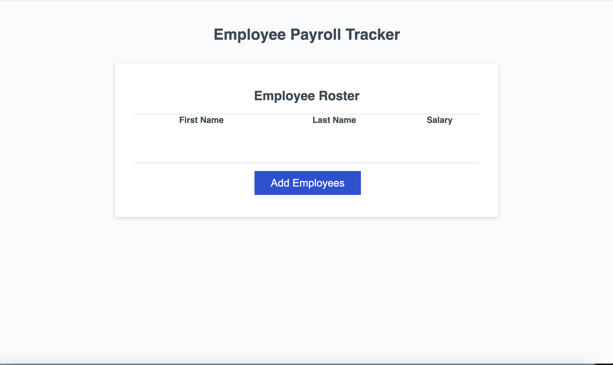

# Challenge 3 UC Berkeley Extension Employee Payroll Application

## Description

In this project I added functions to the starter code that allows the user to input and output employee information into the browser and console using javascript.  This project helped me familiarize the ways to utilize functions, variables, objects, and methods that are used in javascript.  During this coding process I learned that there are many different ways to solve problems that can yield the same results, but it's important to only write code that is necessary.  Using common industry practices help write cleaner code and can potentially improve the program efficiency.

## Installations
Clone a repository called [curly-potato](https://github.com/coding-boot-camp/curly-potato)
 
No installations used (NPM)

## Usage
This program can be used by employers to input and log their employees financial information.  Additonally it can help collect information financial information like the average salary from all employees at a company.

### Link
https://ezekielcampos.github.io/adding-javascript-to-payroll-tracker/
### Screenshot 

## Credit
Xander Rapstine (provided starter code)
* [GitHub](https://github.com/Xandromus)

